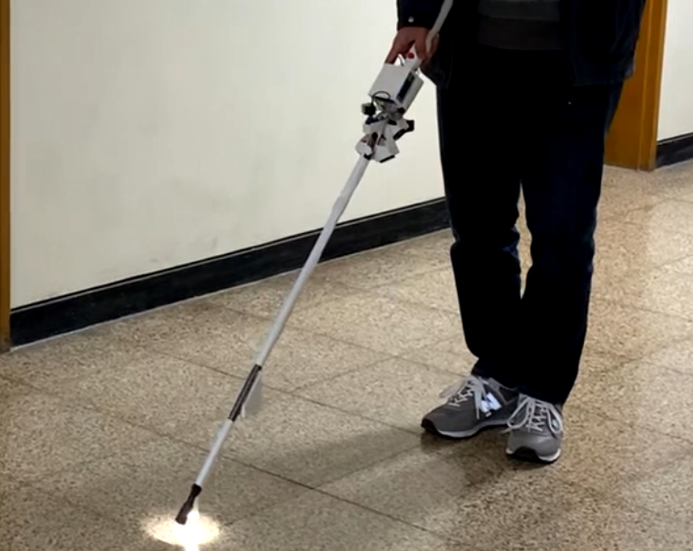

# 2020 스마트 지팡이 팀 프로젝트
2020 상반기 마이크로프로세서 ~ 하반기 센서공학 팀 프로젝트

시각장애인을 보조하기 위하여 여러개의 라이더 센서를 삼각측량법으로 센서 범위 내 고저차를 감지하는 스마트 지팡이 팀 프로젝트

원본 프로젝트 링크

(유튜브 링크)

## 사용 프리패럴 혹은 라이센스

- 아두이노 메가2560 프로 미니

- TFmini Plus LiDAR 센서 (5 EA)
    - 좌, 우 2개씩, 전면 하나, 총 5개의 거리측정용 라이다 센서

- HC-SR04 초음파 센서
    - 지팡이 끝단에 장착되어 전면 고저차 인식

- 

## 역할 소개

- ㅁㄴㅇㄹ :
- ㅁㄴㅇㄹ :
- ㅁㄴㄹㅇ :

## 프로젝트 내용

## 교착점 및 해결방법

