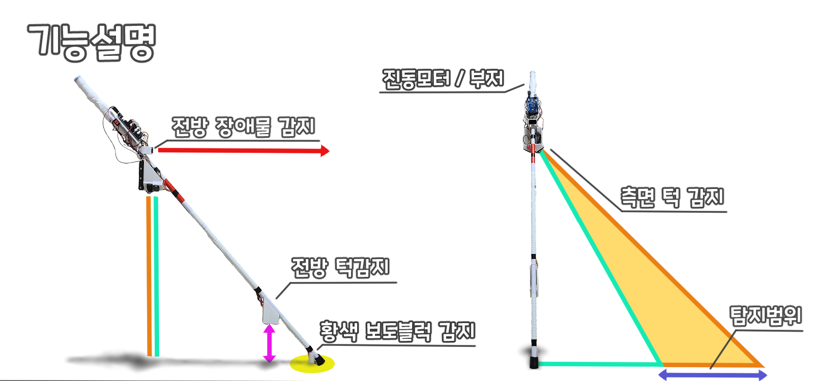

# 2020 스마트 지팡이 팀 프로젝트
2020 상반기 마이크로프로세서 ~ 하반기 센서공학 팀 프로젝트

시각장애인을 보조하기 위하여 여러개의 라이더 센서를 삼각측량법으로 센서 범위 내 고저차를 감지하는 스마트 지팡이 팀 프로젝트

### 

원본 프로젝트 링크

(유튜브 링크)

 

## 개요

라이더센서를 이용하여 시각장애인 좌 우의 고저차에 인한 낙상 방지용 지팡이 제작 프로젝트

- 2020 1학기 - 스마트 지팡이 1호기 제작
- 2020 2학기 - 골목감지 기능을 포함한 스마트 지팡이 2호기 제작

 

## 목적

여러개의 라이더 센서와 삼각측량법을 이용해 지팡이의 좌우 고저차가 발생하면 진동으로 사용자에게 진동으로 알림을 주는 시각장애인 보조 지팡이 제작

**2020 1학기**
- 두 개의 라이더 센서를 이용해 삼각측량법으로 고저차 측정
- 전면 라이더로 지팡이보다 멀리있는 장애물 감지
- 지팡이 끝단 컬러 센서로 황색 보도블럭 감지
- 지팡이 끝단 초음파 센서로 전면 고저차 측정

**2020 2학기**
- 전면 라이더와 서보모터로 주변 지형을 매핑하여 골목 감지
- 더 나은 시제품 품질로 제작작

 

## 사용 프리패럴

- 아두이노 메가2560 프로 미니

- TFmini Plus LiDAR 센서 (5 EA)
    - 좌, 우 2개씩, 전면 하나, 총 5개의 거리측정용 라이다 센서

- HC-SR04 초음파 센서
    - 지팡이 끝단에 장착되어 전면 고저차 인식

- 컬러 인식 센서
    - 지팡이 끝단에 장착되어 황색 보도블럭 인식

 

## 프로젝트 내용

### 기능 설계

- 45도, 30도 두 개의 라이더의 측정 거리로 두 개의 직각 삼각형을 만들어 두 삼각형의 거리차로 고저차를 인식

### 부품 선정
- 라이더 센서 TF MINI 를 사용
- 최대 12m 측정이 가능함
- 아두이노 라이브러리 제공
- 좌 2개, 우 2개, 전면 1개 총 5개
- 6만원대 가격으로 프로젝트 예산을 넘지 않음

- 지팡이 끝 컬러 센서는
- PCB가 원형 모양이라 원기둥 모양의 지팡이에 장착하기 적합

- 초음파 센서로 지팡이 전면 고저차 감지

- 버튼을 눌러 서보 모터를 가동시켜 주변 지형 2D 매핑

- 좌 우 고저차 감지시 해당 방향 진동 부저, 전면 장애물 감지시 단계별 부저 작동
- 프로젝트 당시 다룰 수 있는 MCU는 아두이노 계열만 사용이 가능했다.
- 5개의 라이더 센서와 초음파,

## 교착점 및 해결방법

